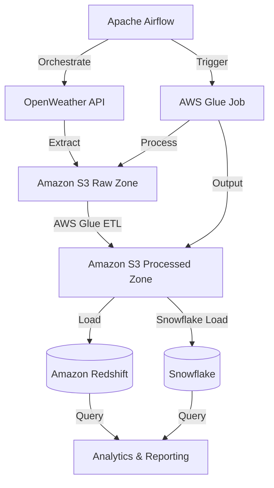

# Cloud-Native Weather Analytics Platform

## 📌 Overview
A production-grade data pipeline that extracts real-time weather data, processes it using AWS Glue, and loads it into Redshift for analytics. This solution demonstrates modern cloud data engineering practices with a focus on scalability, reliability, and maintainability.

## 🎯 Business Value
Organizations can leverage this platform to:
- Make data-driven decisions based on weather patterns
- Perform historical weather analysis
- Integrate weather data with other business metrics
- Build predictive models using weather data

## 🛠️ Tech Stack

### Core Technologies
- **Orchestration**: Apache Airflow (MWAA)
- **Data Lake**: Amazon S3
- **ETL Processing**: AWS Glue (PySpark)
- **Data Warehouse**: Amazon Redshift
- **Infrastructure**: AWS (Manually Configured)
- **Languages**: Python, SQL

### Key Libraries
- **Data Processing**: Pandas, PySpark
- **AWS Integration**: boto3
- **Database**: SQLAlchemy, psycopg2
- **API Integration**: requests

## 🏗️ Architecture



## 📂 Project Structure

```
.
├── openweather_api.py          # Airflow DAG for data extraction to S3
├── transform.py                # AWS Glue ETL script for data processing
├── transform_redshift_load.py  # Script for loading processed data to Redshift
├── Load_Data_Snowflake.ipynb   # Jupyter notebook for Snowflake data loading
├── SnowPark-Python Setup.ipynb # Snowpark Python environment setup
├── Stored-Procedures using SnowPark-Python.ipynb # Snowflake stored procedures
├── requirements.txt            # Python dependencies
└── README.md                   # Project documentation
```

## 🚀 Key Components

### 1. Data Ingestion Layer
- **openweather_api.py** (Airflow DAG)
  - Fetches weather data from OpenWeather API
  - Handles API authentication and rate limiting
  - Processes JSON responses into structured format
  - Stores raw data in S3 for further processing

### 2. Data Processing Layer
- **transform.py** (AWS Glue ETL Job)
  - Serverless PySpark job for large-scale data processing
  - Cleans and transforms raw weather data
  - Implements data validation and error handling
  - Outputs processed data to S3 for loading

### 3. Data Warehouse Loading
- **transform_redshift_load.py**
  - Loads processed data into Amazon Redshift
  - Manages database connections and transactions
  - Handles schema creation and updates
  - Optimized for bulk data loading

### 4. Snowflake Integration
- **Load_Data_Snowflake.ipynb**
  - Demonstrates data loading into Snowflake
  - Includes data transformation examples
  - Shows best practices for Snowflake data loading

### 5. Snowpark Python
- **SnowPark-Python Setup.ipynb**
  - Environment setup for Snowpark Python
  - Basic operations and data processing
  - Integration with Python data science stack

- **Stored-Procedures using SnowPark-Python.ipynb**
  - Implementation of stored procedures
  - Advanced data processing examples
  - Performance optimization techniques

## 🏃‍♂️ Getting Started

### Prerequisites
- AWS Account with appropriate permissions
- Python 3.8+
- Apache Airflow (or MWAA)
- AWS CLI configured
- Snowflake account (for Snowpark features)
- Jupyter Notebook (for Snowpark examples)

### Installation
1. Clone the repository:
   ```bash
   git clone <repository-url>
   cd <project-directory>
   ```

2. Install dependencies:
   ```bash
   pip install -r requirements.txt
   ```

3. Configure AWS credentials:
   ```bash
   aws configure
   ```

4. Set up required AWS resources:
   - S3 buckets for raw and processed data
   - AWS Glue jobs and crawlers
   - Redshift cluster
   - MWAA environment (or local Airflow)

## 🛠️ Usage

1. **Run the ETL pipeline**:
   - Trigger the `openweather_api_dag` in Airflow
   - Monitor execution in the Airflow UI

2. **Query the data in Redshift**:
   ```sql
   SELECT * FROM weather_metrics
   WHERE date >= CURRENT_DATE - INTERVAL '7 days';
   ```

## 📈 Monitoring & Maintenance

- **Airflow UI**: Monitor DAG runs and task status
- **CloudWatch Logs**: Access detailed execution logs
- **Redshift Console**: Monitor query performance and cluster health
- **S3 Lifecycle Policies**: Manage data retention and storage costs

## 🤝 Contributing

1. Fork the repository
2. Create your feature branch (`git checkout -b feature/AmazingFeature`)
3. Commit your changes (`git commit -m 'Add some AmazingFeature'`)
4. Push to the branch (`git push origin feature/AmazingFeature`)
5. Open a Pull Request


## 🙏 Acknowledgments

- OpenWeather for providing the weather data API
- Apache Airflow and AWS for the powerful data orchestration tools
- The open-source community for valuable libraries and tools
